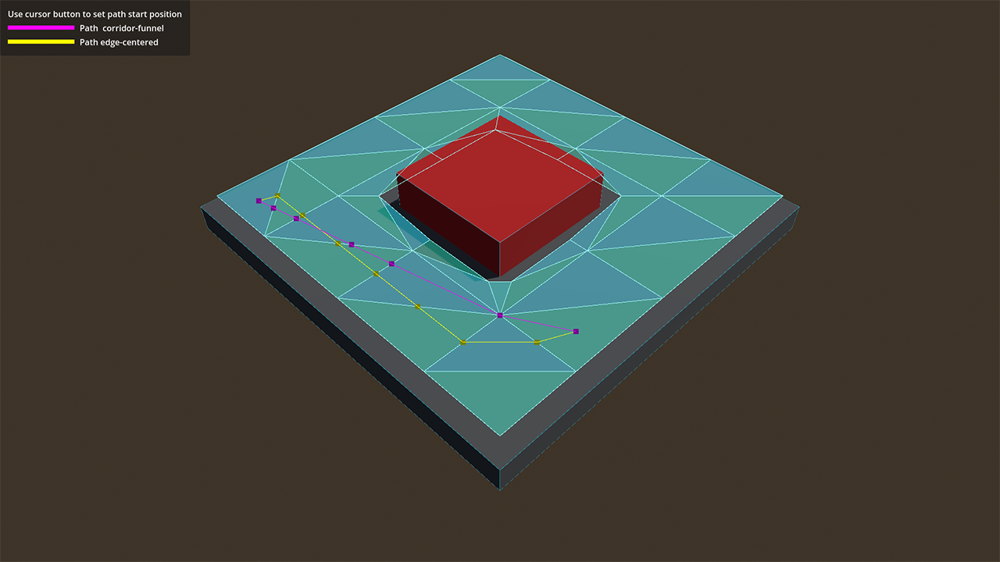

# Navigation Mesh Chunks 3D

Demo that shows how to bake navigation meshes for large world chunk systems.

A mouse cursor left click changes the start position for the debug paths.

Language: GDScript

Renderer: Compatibility

Check out this demo on the Asset Store: https://store.godotengine.org/asset/godot-foundation/navigation-mesh-chunks-3d-demo/

## Screenshots

