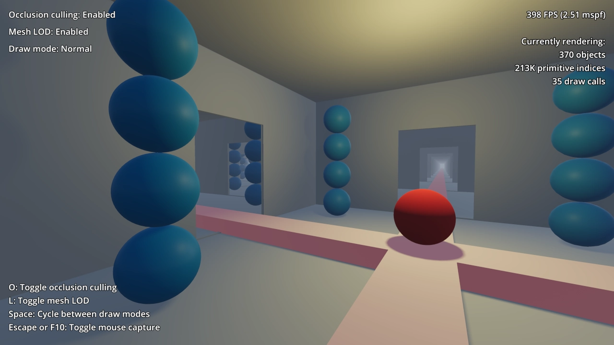

# Occlusion Culling and Mesh LOD

This demo showcases the use of occlusion culling and mesh level of detail in a 3D scene.

The demo contains 1,024 identical rooms in a 64×64 grid. The room geometry is
used as a basis for a baked OccluderInstance3D, which allows each room to be
culled if it is hidden by another room's walls.

Occlusion culling can provide a performance benefit in draw call-bound
scenarios. However, since the Forward+ backend uses a depth prepass, the
shading cost is already reduced by the depth prepass. As a result, occlusion
culling will not always result in a tangible performance increase, especially in
outdoor scenes that have fewer occlusion culling opportunities. Indoor scenes
with no DirectionalLight3D casting shadows are a best-case scenario for
occlusion culling.

The blue spheres make use of automatically generated LODs, which reduce the
number of triangles that need to be rendered each frame by the GPU. This
provides a significant performance increase in scenes with complex geometry. In
most scenes, this provides a greater performance benefit compared to occlusion
culling.

While running the demo, you can toggle the use of mesh LOD and occlusion culling
to view the performance difference these features make in this project. Results
will vary depending on your CPU and GPU model.

> **Warning**
>
> If you are using a engine build that is not fully optimized, you may notice
> that enabling occlusion culling decreases performance. This is because
> occlusion culling is a demanding process on the CPU, which needs all the
> build-time optimization it can get.
>
> Official builds are fully optimized, but self-compiled builds are not fully
> optimized by default (use the `optimize=speed use_lto=yes` SCons options).

Language: GDScript

Renderer: Forward+

## Screenshot

