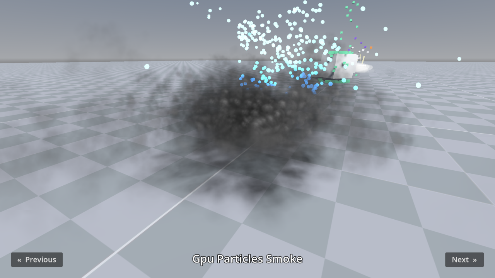

# 3D Particles

This project showcases various 3D particle features supported by Godot, for both GPU-based and CPU-based particles.
This includes particle collision, attractors, trails and subemitters.

Language: GDScript

Renderer: Vulkan Clustered

## Screenshots

