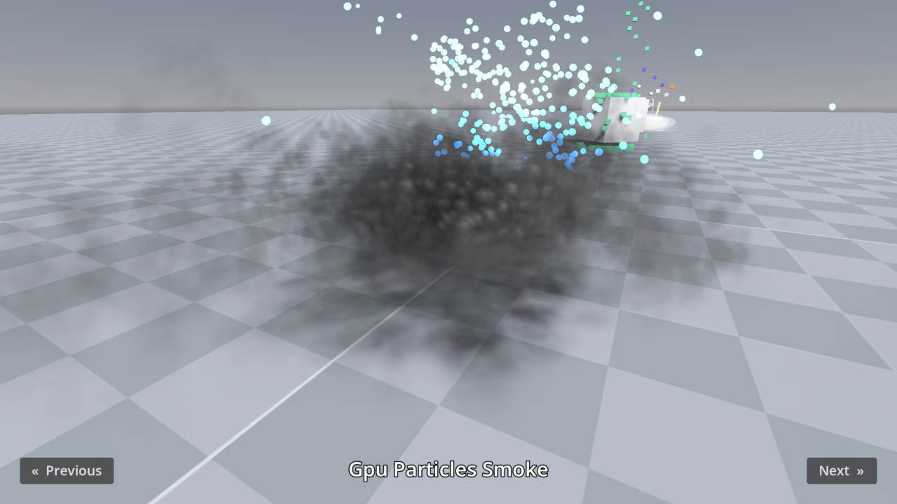

# 3D Particles

This project showcases various 3D particle features supported by Godot, for both GPU-based and CPU-based particles.
This includes particle collision, attractors, trails, and subemitters.

Language: GDScript

Renderer: Forward+

Check out this demo on the Asset Store: https://store.godotengine.org/asset/godot-foundation/particles-3d-demo/

## Screenshots

