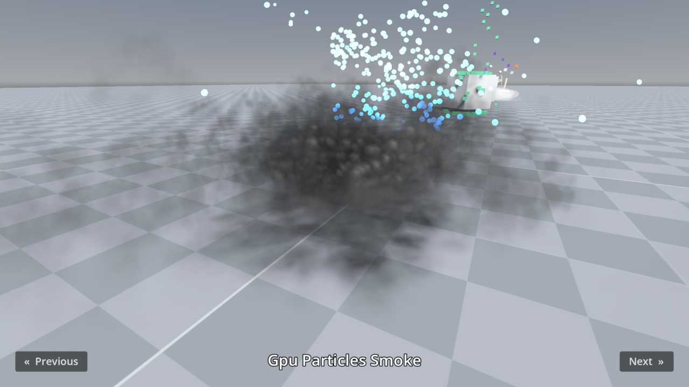

# 3D Particles

This project showcases various 3D particle features supported by Godot, for both GPU-based and CPU-based particles.
This includes particle collision, attractors, trails behind each particle, and subemitters.

> [!TIP]
>
> See also the [3D Trails](../trails) demo, which showcases the Trail3D node.
> Trail3D is easier to set up, and is overall better suited for VFX that only
> needs a few trails at most.
>
> Trail3D also works in all renderers including Compatibility, while
> GPUParticles3D trails are only available in the Forward+ and Mobile renderers.

Language: GDScript

Renderer: Forward+

Check out this demo on the Asset Store: https://store.godotengine.org/asset/godot-foundation/particles-3d-demo/

## Screenshots

