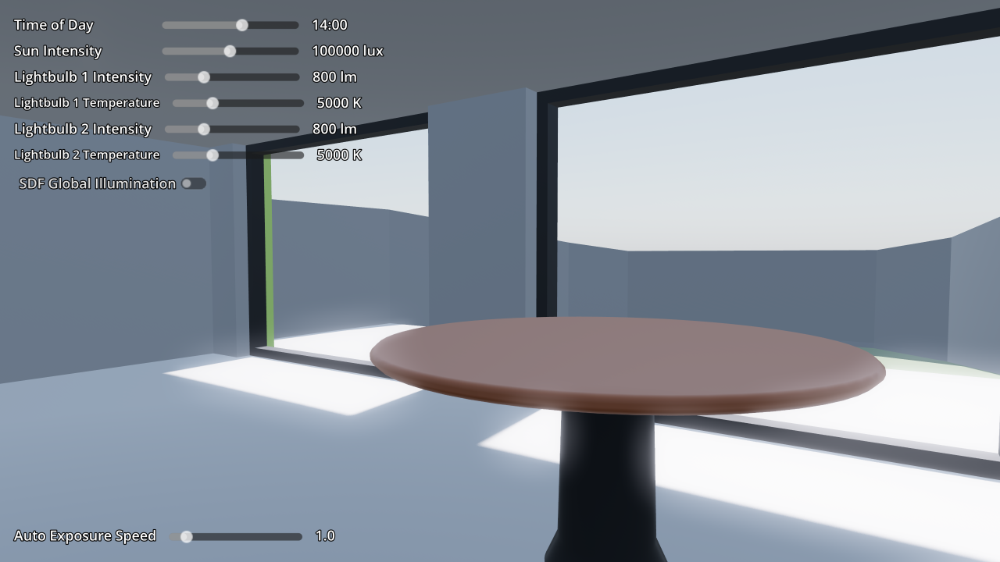

# Physical Light and Camera Units

This demo showcases a
[physical light and camera units](https://docs.godotengine.org/en/latest/tutorials/3d/physical_light_and_camera_units.html)
setup. This allows you to use real world units for lights (lumen, lux, Kelvin)
and cameras (shutter speed, aperture, ISO sensitivity).

By default, Godot uses arbitrary units for many physical properties that apply
to light like color, energy, camera field of view, and exposure. These
properties use arbitrary units, because using accurate physical units comes with
a few tradeoffs that aren't worth it for many games. As Godot favors ease of use
out of the box, physical light units are disabled by default.

If you aim for photorealism in your project, using real world units as a basis
can help make things easier to adjust. References for real world materials,
lights and scene brightness are wildly available on websites such as
[Physically Based](https://physicallybased.info/).

Language: GDScript

Renderer: Forward+

Check out this demo on the asset library: https://godotengine.org/asset-library/asset/2746

## Screenshots

