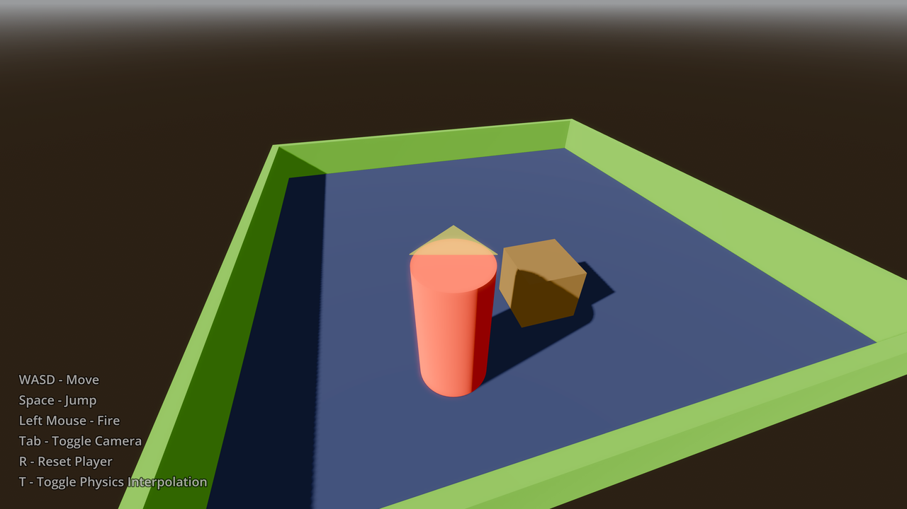

# Physics Interpolation

This demo showcases [physics interpolation](https://docs.godotengine.org/en/stable/tutorials/physics/interpolation/index.html)
in 3D with varying camera modes (first person, third person, fixed perspective).
This is also known as *fixed timestep interpolation*.

Physics interpolation makes motion appear smooth regardless of the rendered
framerate and physics ticks per second configured in the Project Settings.
There are some caveats related to its usage though, such as increased latency
and potential issues with teleporting objects. It's recommended to go
through the
[documentation](https://docs.godotengine.org/en/stable/tutorials/physics/interpolation/physics_interpolation_introduction.html)
when enabling physics interpolation in a project.

Physics interpolation is enabled by default in this project. Press <kbd>T</kbd>
to toggle it while the demo is running. This allows you to see the impact on
smoothness of physics interpolation.

Language: GDScript

Renderer: Compatibility

## Screenshots

