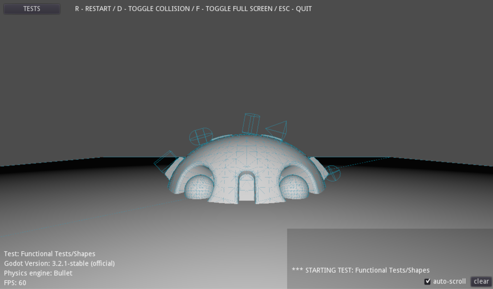

# 3D Physics Tests

This demo contains a series of tests for the 3D
physics engine.

They can be used for different purposes:

- Functional tests to check for regressions and
  compare the behavior between physics engines
- Performance tests to evaluate and compare
  performance between physics engines

Language: GDScript

Renderer: Forward+

Check out this demo on the asset library: https://godotengine.org/asset-library/asset/2747

## Screenshots

