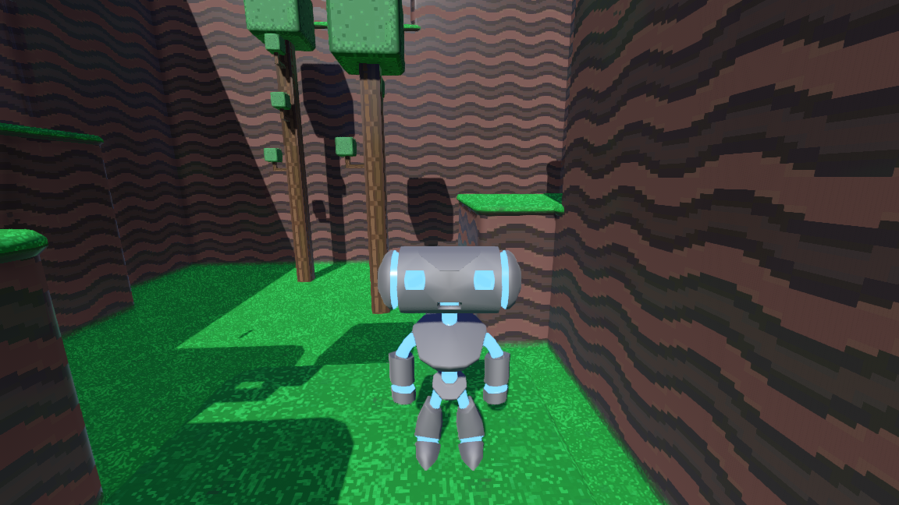
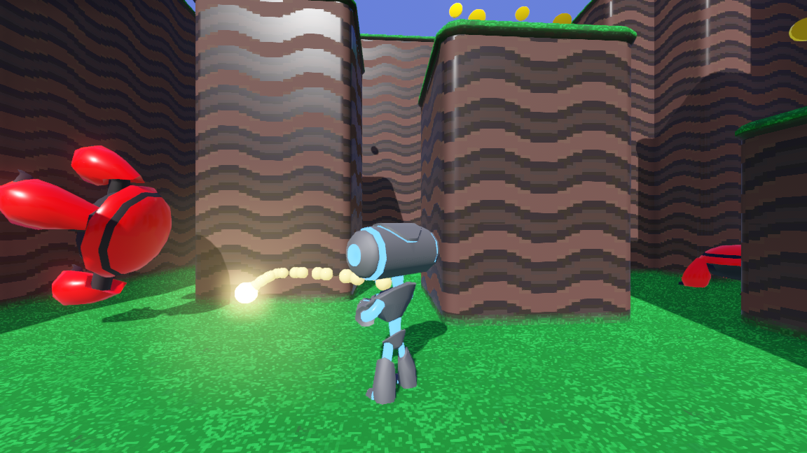

# Platformer 3D

3D Platformer demo using a
[`KinematicBody`](https://docs.godotengine.org/en/latest/classes/class_kinematicbody.html).
It uses similar code to the 2D platformer, but implemented in 3D.
It also features audio reverberation (it sounds echo-y).

Language: GDScript

Renderer: GLES 3

## Screenshots

