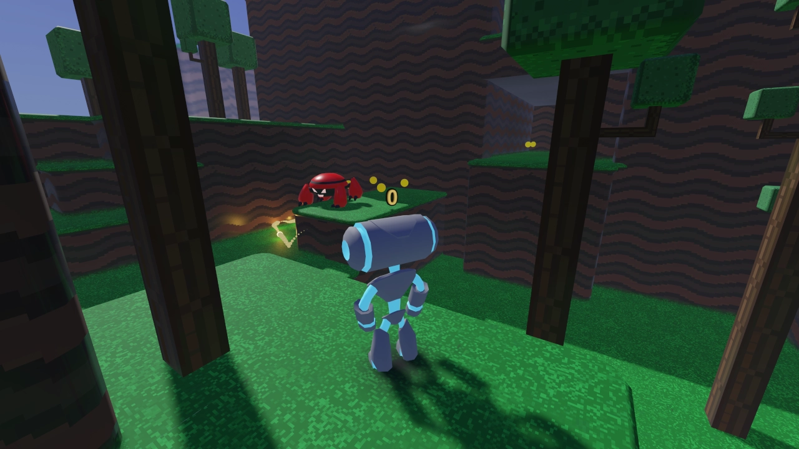

# Platformer 3D

3D Platformer demo using a
[`CharacterBody3D`](https://docs.godotengine.org/en/latest/classes/class_characterbody3d.html).
It uses similar code to the 2D platformer, but implemented in 3D.

Language: GDScript

Renderer: Forward+

Check out this demo on the asset library: https://godotengine.org/asset-library/asset/2748

## Screenshots

