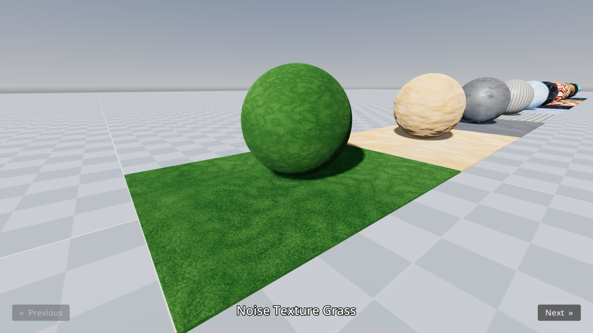

# Procedural Materials

This demo includes procedurally generated materials with 3 different techniques:

- **[NoiseTexture2D](https://docs.godotengine.org/en/stable/classes/class_noisetexture2d.html):**
  Built-in class that generates images on the CPU based on
  noise patterns (such as Simplex or Cellular). This is suited for static
  textures only. Texture generation is done asynchronously and is faster than
  using scripting, since the noise algorithms are implemented in C++ in the
  engine.

- **Scripting:** Uses the
  [Image](https://docs.godotengine.org/en/stable/classes/class_image.html) class
  to procedurally generate an
  [ImageTexture](https://docs.godotengine.org/en/stable/classes/class_imagetexture.html)
  on the CPU. This is suited for static textures only. This approach is more
  flexible than NoiseTexture2D, but is slower to generate textures. Once the
  texture is generated, rendering performance is identical to NoiseTexture2D.

- **Shaders:** Uses a 2D shader on a
  [ColorRect](https://docs.godotengine.org/en/stable/classes/class_colorrect.html)
  node that matches a
  [Viewport](https://docs.godotengine.org/en/stable/classes/class_viewport.html)'s
  size with the resulting
  [ViewportTexture](https://docs.godotengine.org/en/stable/classes/class_viewporttexture.html)
  applied to a material. This is updated on the GPU in real-time, and is most
  suited for animated textures. This approach can also be used for static
  textures, with a lower performance overhead since the texture doesn't need to
  be updated every frame.

Language: GDScript

Renderer: Forward+

Check out this demo on the asset library: https://godotengine.org/asset-library/asset/2749

## Screenshots

