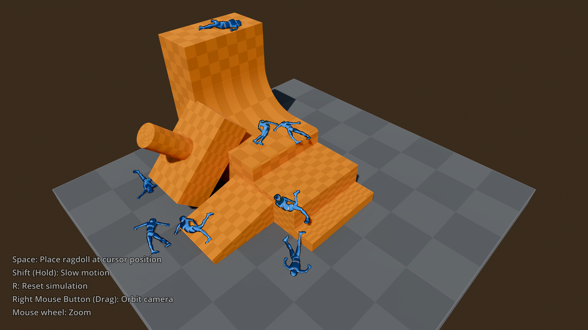

# Ragdoll Physics

This demo includes an example of ragdoll simulation for characters.

The ragdoll setup in this demo was performed by following the [Ragdoll system](https://docs.godotengine.org/en/stable/tutorials/physics/ragdoll_system.html)
tutorial. The character script also has an `initial_velocity` variable implemented,
which will give an impulse to all bones part of the ragdoll system.
This initial impulse is typically used in games to make ragdoll effects more impactful,
e.g. giving additional recoil after taking a punch.

Impact sounds are played according to the impact speed, and are played with
reduced pitch when slow motion mode is engaged. This uses
`AudioServer.playback_speed_scale` which affects all audio,
so in a more complex project, you would want to use
[audio buses](https://docs.godotengine.org/en/stable/tutorials/audio/audio_buses.html)
which can make the effect only apply to certain sounds. This can be used to keep
music unaffected by the pitch shifting effect.

Character models use outlines provided by the BaseMaterial3D **Stencil > Mode**
property. The scene's static geometry is designed using CSG nodes and is baked to a
static mesh and collision to improve load times and allow for global illumination
with LightmapGI.

Controls:

- <kbd>Space</kbd>: Add a ragdoll at the mouse cursor position
- <kbd>Shift</kbd> (hold): Enable slow motion mode (1/4 speed)
- <kbd>R</kbd>: Reset ragdoll simulation and remove user-placed ragdolls
- <kbd>Right Mouse Button</kbd>: Orbit camera
- <kbd>Mouse Wheel</kbd>: Zoom

Language: GDScript

Renderer: Forward+

## Screenshots

