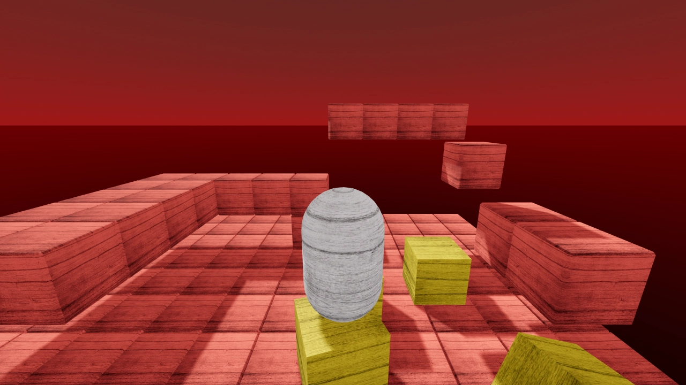

# RigidBody Character 3D

RigidBody character demo for 3D using a capsule for the character.
Cubes as RigidBodies spawn in the map from above to show interaction
with the player (jump on them, gently push them), which would be
impossible with a CharacterBody.

Language: GDScript

Renderer: Forward+

Check out this demo on the asset library: https://godotengine.org/asset-library/asset/2750

## How does it work?

This demo uses a [`RigidBody3D`](https://docs.godotengine.org/en/stable/classes/class_rigidbody3d.html)
for the player, and [`StaticBody3D`](https://docs.godotengine.org/en/latest/classes/class_staticbody3d.html)
for the level. Each has colliders, the player moves itself via
`apply_central_impulse()` in `_physics_process()`, and collides with the level.

The [`ShapeCast3D`](https://docs.godotengine.org/en/latest/classes/class_shapecast3d.html) node is used to detect whether the player is able to jump
(i.e. touching the floor). Compared to a [`RayCast3D`](https://docs.godotengine.org/en/latest/classes/class_raycast3d.html) which is infinitely thin,
this allows for more reliable checking if the player is standing over an edge or
corner.

## Screenshots

