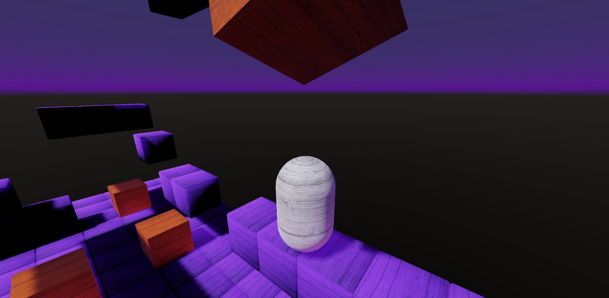
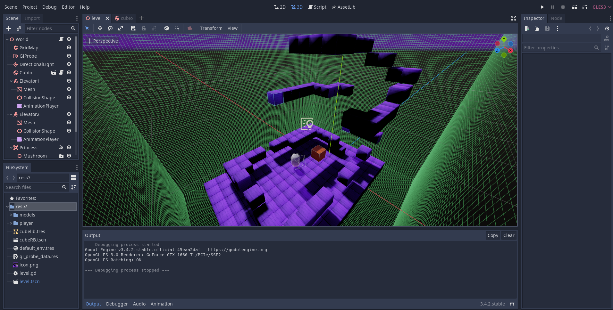

# RigidBody Character 3D

RigidBody character demo for 3D using a capsule for the character.
Cubes as RigidBodies spawn in the map from above to show interaction
with the player (jump on them, gently push them), which would be
impossible with a KinematicBody.

Language: GDScript

Renderer: GLES 3

## How does it work?

This demo uses a [`RigidBody`](https://docs.godotengine.org/en/stable/classes/class_rigidbody.html)
for the player, and [`StaticBody`](https://docs.godotengine.org/en/latest/classes/class_staticbody.html)
for the level. Each has colliders, the player moves itself via
`apply_central_impulse()` in `_physics_process()`, and collides with the level.

## Screenshots

