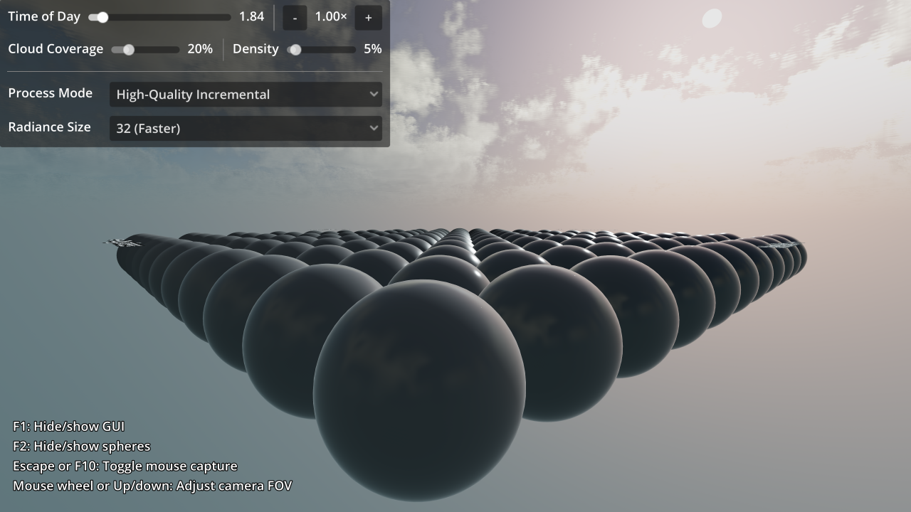

# 3D Sky Shaders

An example of a sky shader in Godot. This shader features real-time volumetric
clouds and physical sky with Raleigh and Mie scattering, which causes the sky's
colors to adjust automatically depending on the sun angle. The sun's angle is set
automatically from the first DirectionalLight3D node in the scene
(unless its sky mode is **Light Only**).

Physical sky features are based on the built-in PhysicalSkyMaterial, while
volumetric clouds were added after converting PhysicalSkyMaterial to a
ShaderMaterial using the **Convert to ShaderMaterial** button in the editor
resource dropdown.

> **Warning**
>
> Sky shaders are rendered every frame if they use the `TIME` variable or are
> otherwise updated every frame (e.g. if an uniform is updated in `_process()`
> or with an AnimationPlayer). This has a significant performance impact for
> complex sky shaders. The performance impact can be reduced by adjusting the
> radiance map properties in Environment, but it will remain significant.
>
> The shader in this demo project is expensive, and is intended to be used in
> games where most of the sky remains visible at all times (such as flight
> simulators).
>
> Optimizations to sky shader rendering are planned in future Godot releases.

Language: GDScript

Renderer: Forward Plus

## How does it work?

The day/night cycle is performed using an AnimationPlayer node that adjusts node
properties and the sky shader parameters in real-time.

Spheres with varying levels of roughness and metallic materials are instanced using
a [`@tool` script](https://docs.godotengine.org/en/latest/tutorials/plugins/running_code_in_the_editor.html)
so that they don't have to be created manually in the editor, yet they can still be previewed within the editor.

## Screenshots

