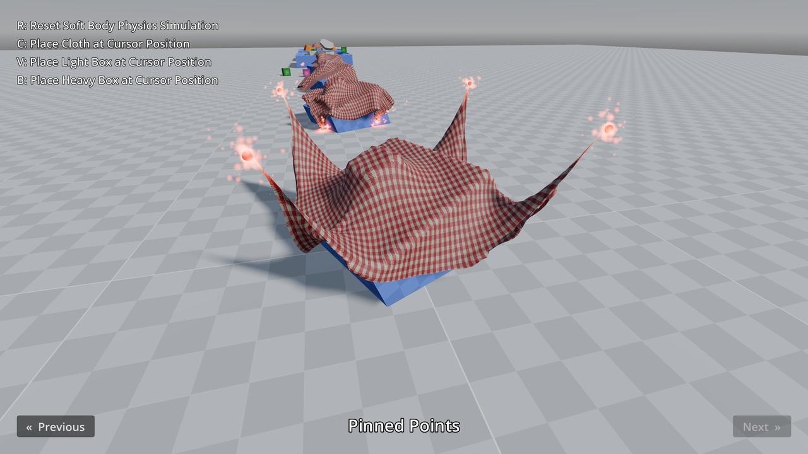

# 3D Soft Body Physics

An example of [soft body physics](https://docs.godotengine.org/en/latest/tutorials/physics/soft_body.html)
(deformable objects) such as cloth, boxes and spheres.

Soft bodies support pinning points as well as applying impulses/forces to specific points,
which can be useful for effects such as wind.

Soft bodies can interact with static, rigid and character bodies (and will be aware of rigid bodies'
weight when doing so). However, soft bodies currently do **not** interact with other soft bodies,
which means they will pass through each other.

The per-point impulse timer example also showcases how to attach nodes to specific points of a SoftBody3D.
This can be used to make particles, meshes or even rigid bodies follow specific points.

The cloth soft bodies in this demo use a BaseMaterial3D with the **Grow** property enabled to prevent
visible clipping into surfaces.

Controls:

- <kbd>R</kbd>: Reset soft body simulation and user-placed objects
- <kbd>C</kbd>: Place cloth at cursor position
- <kbd>V</kbd>: Place light box at cursor position
- <kbd>B</kbd>: Place heavy box at cursor position

For performance reasons, only 10 user-placed objects can be present at a time in this demo.
The oldest objects will be removed when attempting to place more than 10 objects.

Language: GDScript

Renderer: Forward+

## Screenshots

