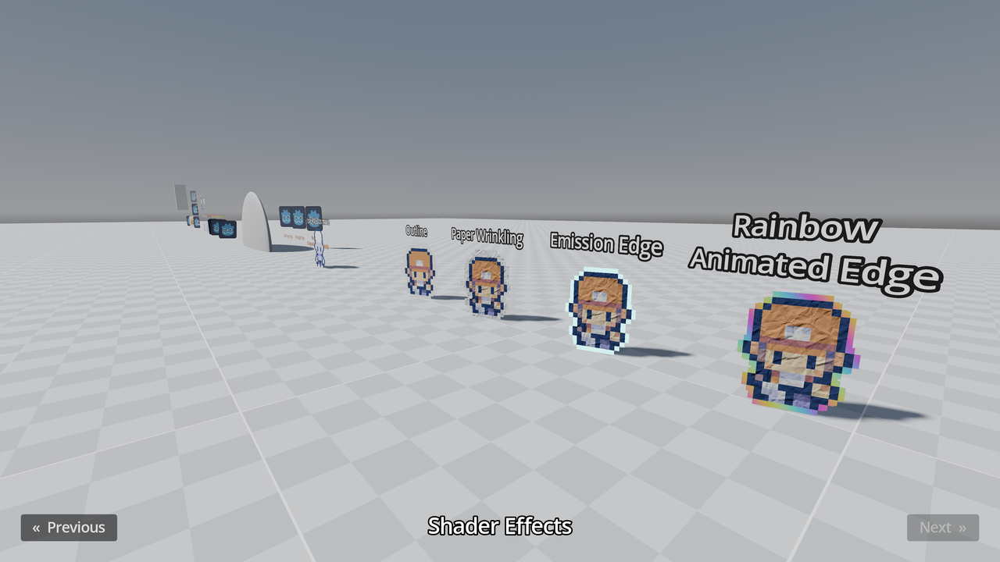

># 3D Sprites and Animated Sprites

This project demonstrates the usage of Sprite3D and AnimatedSprite3D in 3D
space.

Both Sprite3D and AnimatedSprite3D are nodes that allow 2D textures or
animations to exist within a 3D world. They are particularly useful for stylized
or lightweight 3D effects using traditional 2D assets.

- **Sprite3D:** A node that renders a single 2D texture or frame in 3D space. It
  can be rotated, scaled, and positioned like any 3D node. Optionally, it can
  behave as a billboard to always face the camera.
- **AnimatedSprite3D:** Extends Sprite3D by supporting frame-based animation. You
  can assign a SpriteFrames resource to play sequences of textures, making it
  suitable for character sprites, visual effects, or flipbook-style animations in
  3D.

Both types can be combined with custom shaders to simulate outlines, lighting
effects, or other visual enhancements. In most scenarios, Sprite3D is used for
static images or simple animations, while AnimatedSprite3D is preferred for more
complex animations or when you need to manage multiple frames efficiently.

This demo includes examples of basic rotation animation and showcases how
shaders can be applied to Sprite3D and AnimatedSprite3D for stylized results.
The shaders demostration also shows how to create paper-like effects, which can
be useful for creating a unique visual style in most of the game.

Language: GDScript

Renderer: Forward+

## Screenshots

