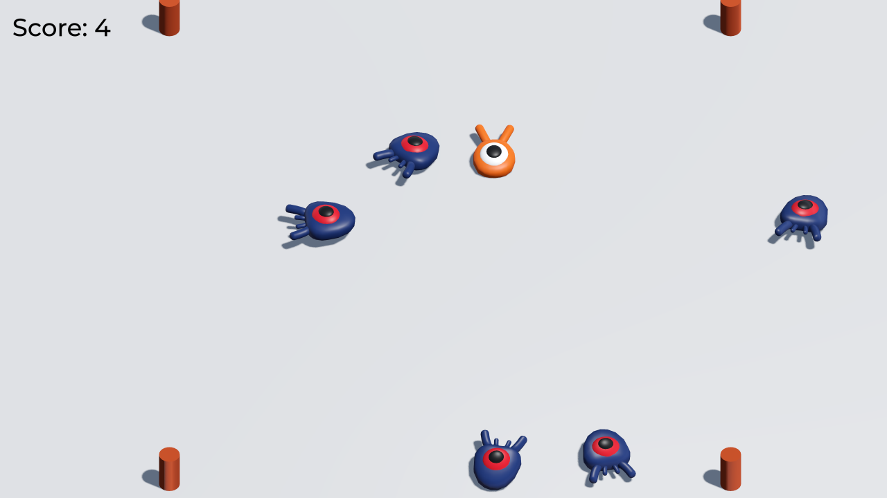

# Squash the Creeps (3D)

This is a simple game where your character must move
and jump to squash as many enemies for as long as possible.
You gain 1 point for every enemy squashed.

Controls:

- <kbd>Up Arrow</kbd>, <kbd>W</kbd>, <kbd>Gamepad Left Stick</kbd>: Move up
- <kbd>Down Arrow</kbd>, <kbd>S</kbd>, <kbd>Gamepad Left Stick</kbd>: Move down
- <kbd>Left Arrow</kbd>, <kbd>Gamepad Left Stick</kbd>: Move left
- <kbd>Right Arrow</kbd>, <kbd>Gamepad Left Stick</kbd>: Move right
- <kbd>Space</kbd>, <kbd>Right Mouse Button</kbd>, <kbd>Gamepad A/Cross</kbd>: Jump

This is a finished version of the game featured in the
["Your first 3D game"](https://docs.godotengine.org/en/latest/getting_started/first_3d_game/index.html)
tutorial in the documentation. For more details,
consider following the tutorial in the documentation.

This demo covers:

- Handling player input.
- Moving and jumping in a 3D game.
- Spawning enemies randomly around the game arena.
- Using the built-in animation editor to breathe life to your game.
- Creating a complete game loop with lose conditions, score, and the ability to restart.

Language: GDScript

Renderer: Forward+

Check out this demo on the asset library: https://godotengine.org/asset-library/asset/2751

## Screenshots

## Copying

`art/House In a Forest Loop.ogg` Copyright &copy; 2012 [HorrorPen](https://opengameart.org/users/horrorpen), [CC-BY 3.0: Attribution](http://creativecommons.org/licenses/by/3.0/). Source: https://opengameart.org/content/loop-house-in-a-forest

Font is "Montserrat Medium". Copyright 2011 [The Montserrat Project Authors](https://github.com/JulietaUla/Montserrat). Details are in `fonts/LICENSE.txt`.
