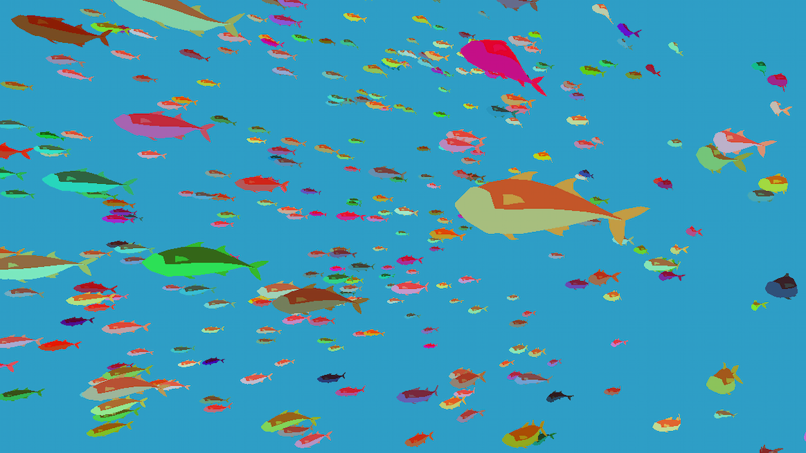

# Thousands of Fish

An example of how to animate a mesh using a shader, then create thousands of varied copies
using MultiMesh or GPU particles.

This is for the
[Animating thousands of fish](https://docs.godotengine.org/en/stable/tutorials/performance/vertex_animation/animating_thousands_of_fish.html) and
[Controlling thousands of fish with Particles](https://docs.godotengine.org/en/stable/tutorials/performance/vertex_animation/controlling_thousands_of_fish.html)
tutorials in the documentation.

## How it works

The original mesh's surface materials must be replaced or overridden with a ShaderMaterial
that can apply a custom animation shader. A ShaderMaterial has custom data unique to it
and a shader file that can be shared across materials. Replacing a material will remove custom data,
like the colors on the mesh. AnimatedFish demonstrates how to copy properties from the original
material into the new ShaderMaterial.

An alternative method is to right-click a mesh and choose **Make Unique**, then right-click the
mesh surface material and choose **Convert to ShaderMaterial**. A converted material will make
an editable shader that applies the original properties by default, and can be modified or read
to see how it's done. Each surface should share the same shader to make the animation easier,
but can still have individual material values if set up manually.

MultiMesh creates instances of a mesh using per-instance transforms (position, rotation, scale),
but must update transforms on the CPU. Instead, GPUParticles3D updates happen on the GPU,
efficiently moving objects. Each node can function independently, except for this example having
the model set up in the AnimatedFish mesh node.

## How to use it

The AnimatedFish node has an export to change the mesh model used.
The export also changes the model for MultiFish and ParticleFish.

Use <kbd>W</kbd>/<kbd>A</kbd>/<kbd>S</kbd>/<kbd>D</kbd> to move the camera and the mouse to look around.

### Tweaking the animation

The major animation variables are exported as instance uniforms. Instance uniforms are shared
across surface materials, making it easier to edit values on each surface's ShaderMaterial at once.
These variables are accessed in the GeometryInstance3D section of the inspector,
and must be edited separately for each node using the Fish model.

### Multiply the fish

The MultiFish node needs to have its instance count increased before it will show multiple fish.
Doing so will cause visual glitches due to random transforms being generated per fish.
To fix the transforms, press the exported **Refresh** button to run the node's code.
Increasing the instance count in the inspector will also increase the scene size, due to caching the
transforms. To avoid a large cache, set the instance size programmatically once the game starts.

ParticleFish uses GPU particles to allow the fish to move and for a set lifetime.
GPUParticles3D has many options to experiment with in the inspector. The main variables are
the amount and the lifetime. Note that cull margin or a custom AABB may be set in GeometryInstance3D,
to avoid the fish disappearing because the emitter went off-screen.

For more details, consider following the [Animating thousands of fish](https://docs.godotengine.org/en/stable/tutorials/performance/vertex_animation/animating_thousands_of_fish.html)
and [Controlling thousands of fish with Particles](https://docs.godotengine.org/en/stable/tutorials/performance/vertex_animation/controlling_thousands_of_fish.html)
tutorials in the documentation.

Language: GDScript

Renderer: Forward+

## Screenshots

## License

The [fish model](https://quaternius.com/packs/animatedfish.html) in this tutorial is made by
QuaterniusDev and is licensed under [CC0 1.0 Universal](https://creativecommons.org/publicdomain/zero/1.0/).
