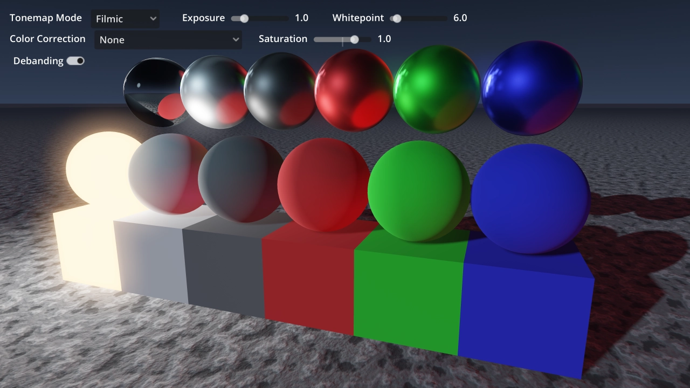

# Tonemapping and Color Correction

This showcases various tonemapping operators and their interaction with several
color correction textures (1D and 3D).

A script generating neutral 3D LUT textures is also included.

Language: GDScript

Renderer: Forward+

## Screenshots

