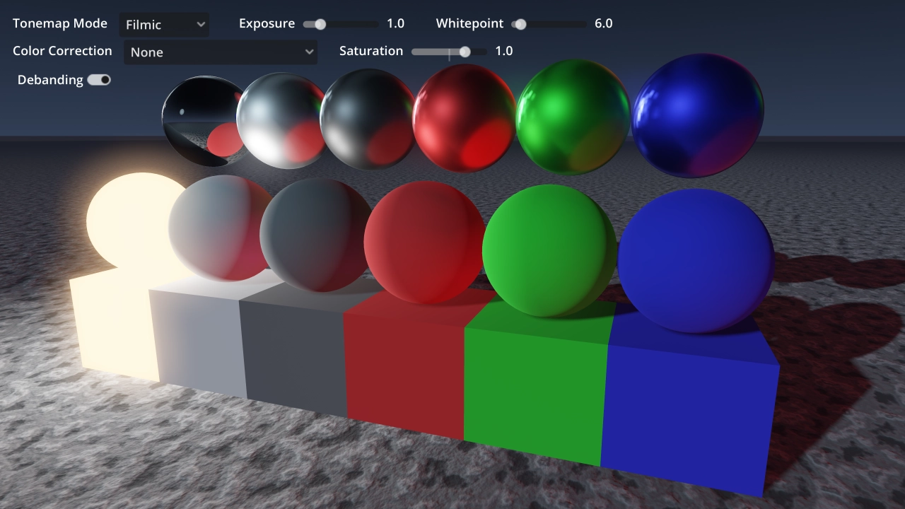

# Tonemapping and Color Correction

This showcases various tonemapping operators and their interaction with several
color correction textures (1D and 3D).

A script generating neutral 3D LUT textures is also included.

Language: GDScript

Renderer: Forward+

Check out this demo on the Asset Store: https://store.godotengine.org/asset/godot-foundation/tonemapping-and-color-correction-demo/

## Screenshots

