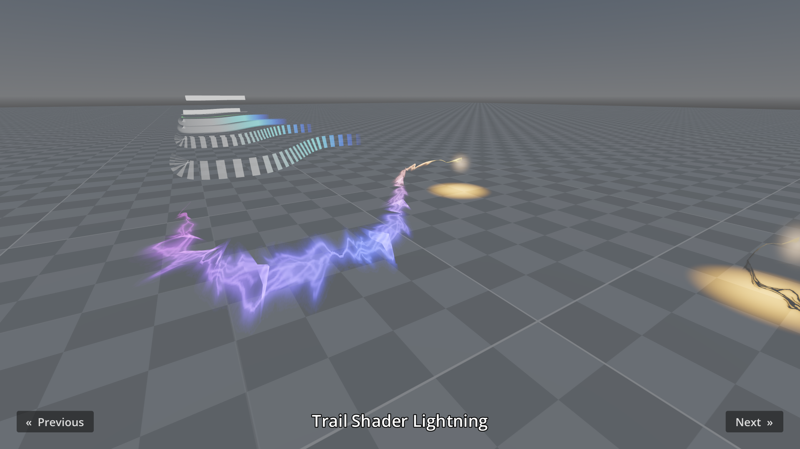

# 3D Trails

This project showcases various 3D trail features supported by Godot,
using the [Trail3D](https://docs.godotengine.org/en/latest/classes/class_trail3d.html) node.
This includes width curves, color curves (gradients), textured trails, and custom shaders to apply
vertex distortion.

This node can be used to create trails behind moving objects, add trails when using a sword, and more.

> [!TIP]
>
> See also the [3D Particles](../particles) demo, which supports trails behind
> each particle for GPU-based particles. Compared to GPUParticles3D trails,
> Trail3D is easier to set up and works in all renderers (including
> Compatibility).

Language: GDScript

Renderer: Forward+

Check out this demo on the Asset Store: https://store.godotengine.org/asset/godot-foundation/trails-3d-demo/

## Screenshots

