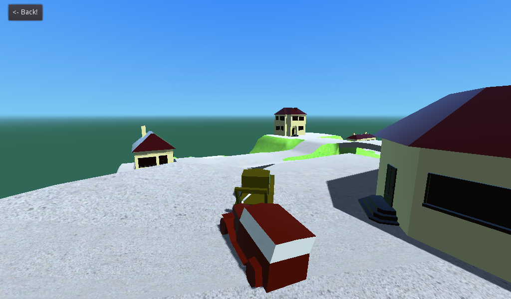

# Truck Town

This is a demo implementing different types of trucks of
varying complexity using vehicle physics.

Do not be surprised if everything is bouncy and glitchy,
Godot's physics system is not polished and will likely be
reworked in the future.

Language: GDScript

Renderer: GLES 2

Check out this demo on the asset library: https://godotengine.org/asset-library/asset/524

## How does it work?

The base vehicle uses a
[`VehicleBody`](https://docs.godotengine.org/en/latest/classes/class_vehiclebody.html)
node. The trailer truck is tied together using a
[`ConeJointTwist`](https://docs.godotengine.org/en/latest/classes/class_conetwistjoint.html)
node, and the tow truck is tried together using a chain made of
[`RigidBody`](https://docs.godotengine.org/en/latest/classes/class_rigidbody.html)
nodes which are pinned together using
[`PinJoint`](https://docs.godotengine.org/en/latest/classes/class_pinjoint.html) nodes.

## Screenshots

