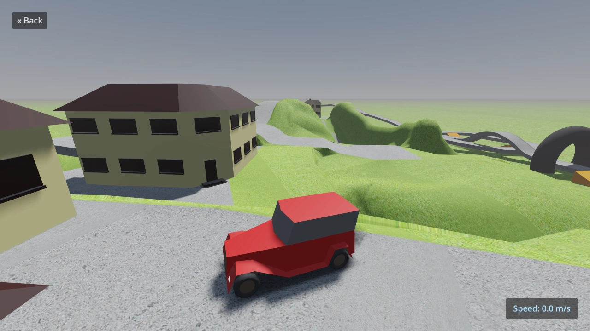

# Truck Town

This is a demo implementing different types of trucks of
varying complexity using vehicle physics.

Controls:

- <kbd>Up Arrow</kbd>, <kbd>W</kbd>, <kbd>Gamepad Right Trigger</kbd>, <kbd>Gamepad A/Cross</kbd>: Accelerate
- <kbd>Down Arrow</kbd>, <kbd>S</kbd>, <kbd>Gamepad Left Trigger</kbd>, <kbd>Gamepad B/Circle</kbd>, <kbd>Gamepad X/Square</kbd>: Brake/reverse
- <kbd>Left Arrow</kbd>, <kbd>Gamepad Left Stick</kbd>, <kbd>Gamepad D-Pad Left</kbd>: Steer left
- <kbd>Right Arrow</kbd>, <kbd>Gamepad Left Stick</kbd>, <kbd>Gamepad D-Pad Right</kbd>: Steer right
- <kbd>U</kbd>, <kbd>Gamepad Select</kbd>, left-click speedometer: Change speedometer unit (m/s, km/h, mph)
- <kbd>C</kbd>, <kbd>Gamepad Y/Triangle</kbd>: Change camera (exterior, interior, top-down)
- <kbd>Escape</kbd>, <kbd>Gamepad D-Pad Up</kbd>: Go back to menu (press again to exit)

On mobile platforms, the vehicle automatically accelerates. Touch the left and
right edges of the screen to steer. Touch the middle of the screen to
brake/reverse (this also temporarily stops acceleration).

Language: GDScript

Renderer: Forward+ on desktop, Mobile on mobile

Check out this demo on the asset library: https://godotengine.org/asset-library/asset/524

## How does it work?

The base vehicle uses a
[`VehicleBody`](https://docs.godotengine.org/en/latest/classes/class_vehiclebody.html)
node. The trailer truck is tied together using a
[`ConeJointTwist`](https://docs.godotengine.org/en/latest/classes/class_conetwistjoint.html)
node, and the tow truck is tried together using a chain made of
[`RigidBody`](https://docs.godotengine.org/en/latest/classes/class_rigidbody.html)
nodes which are pinned together using
[`PinJoint`](https://docs.godotengine.org/en/latest/classes/class_pinjoint.html) nodes.

## Screenshots

