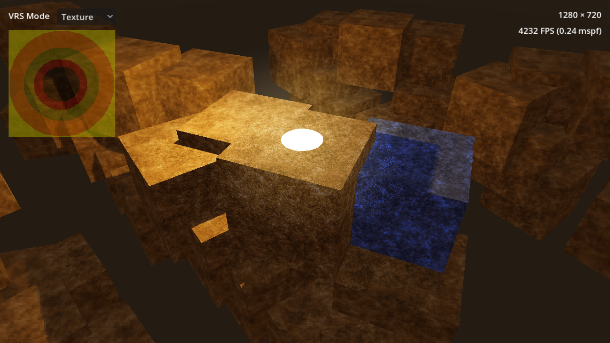

# Variable Rate Shading

This project showcases how to use
[variable rate shading](https://docs.godotengine.org/en/latest/tutorials/3d/variable_rate_shading.html)
(VRS) in 3D to improve performance.

Performance metrics are also displayed to evaluate potential performance gains.

Language: GDScript

Renderer: Forward Plus

## Screenshots

