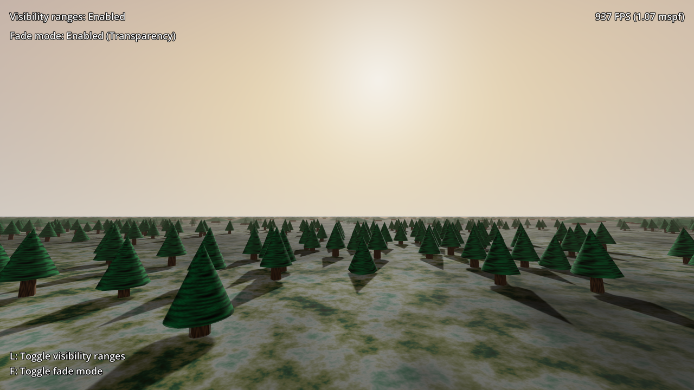

# Visibility Ranges (HLOD)

This demo showcases how to set up a hierarchical LOD system using visibility ranges.

This can improve performance significantly in 3D scenes by reducing the number of
draw calls and polygons that have to be drawn every frame.

Use WASD or arrow keys to move, and use the mouse to look around. Press
<kbd>L</kbd> to toggle the use of visibility ranges. Press <kbd>F</kbd> to
toggle the fade mode between *transparency* (the default in this demo) and
*hysteresis* (which is slightly faster, but results in more jarring
transitions).

> **Note**
>
> Performance is expected to decrease significantly after disabling visibility ranges,
> as all trees will be drawn with full detail regardless of distance.

Language: GDScript

Renderer: Forward Plus

## How does it work?

There are 2 goals when using visibility ranges to improve performance:

- Reduce the number of polygons that need to be drawn.
- Reduce the number of draw calls, while also preserving culling opportunities when up close.

To achieve this, the demo contains four levels of LOD for each cluster of 16 trees.
These are the levels displayed from closest to furthest away:

- Individual tree, with high geometric detail.
- Individual tree, with low geometric detail.
- Tree cluster, with high geoemtric detail.
- Tree cluster, with low geometric detail.

When the distance between the camera and the tree's origin is greater than 20
units, the high-detail tree blends into a low-detail tree (transition period
lasts 5 units).

When the distance between the camera and the tree's origin is greater than 150
units, all low-detail trees in the cluster are hidden, and the trees blend into
a high-detail tree cluster. This transition period lasts for a longer distance
(50 units) as the visual difference between these LOD levels is greater.

When the distance between the camera and the cluster's origin is greater than
450 units, the high-detail tree cluster blends into a low-detail tree cluster
(also with a transition period of 50 units).

When the distance between the camera and the cluster's origin is greater than
1,900 units, the low-detail tree cluster fades away with a transition period of
100 units. At this distance, the fog present in the scene makes this transition
harder to notice.

There are several ways to further improve this LOD system:

- Use MultiMeshInstance3D to draw clusters of geometry in a single draw call.
  However, individual meshes will not benefit from frustum or occlusion culling
  (only the entire cluster is culled at once). Therefore, this must be done
  carefully to balance the number of draw calls with culling efficiency.
- Use impostor sprites in the distance. These can be drawn with Sprite3D, or
  using MeshInstance3D + QuadMesh with a StandardMaterial3D that has
  billboarding enabled.

## Screenshots

