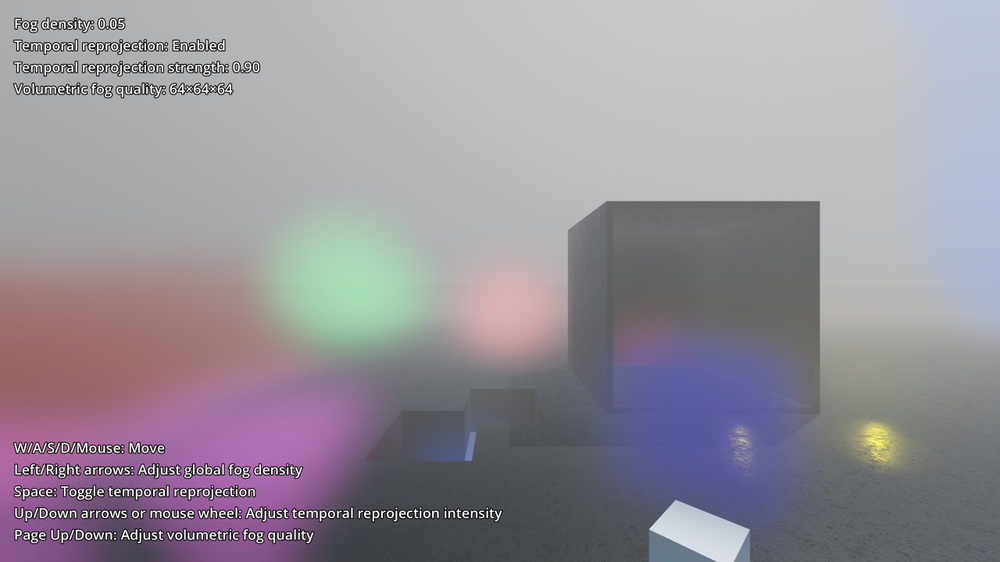

# Volumetric Fog

This is an example of Godot's volumetric fog capabilities with the Vulkan renderer.

Showcased features are:

- Positive/negative density volumes that affect albedo (incoming light) and emission.
- Box/ellipsoid shapes, height falloff, and density modulation using a 3D texture.
- Temporal reprojection for greater stability and avoiding flickering.
  - The difference is demonstrated with a moving fog volume.
- Global density adjustment. With FogVolume nodes that have a positive density,
  it's possible to apply volumetric fog only in specific areas.
- Custom FogVolume shader with real-time 3D noise
  ([provided by alghost](https://godotshaders.com/shader/moving-gradient-noise-fog-mist-for-godot-4/)).

Language: GDScript

Renderer: Forward+

Check out this demo on the asset library: https://godotengine.org/asset-library/asset/2754

## Screenshots

