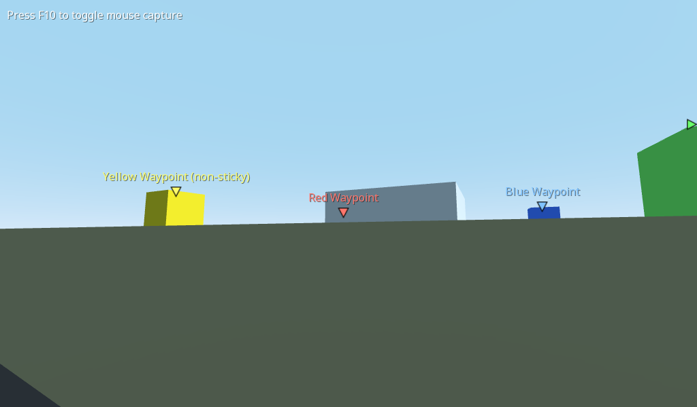

# 3D Waypoints

This is an example of displaying GUI elements such as Labels in a 3D world,
by projecting the 3D position onto the screen and displaying the GUI elements
directly, instead of relying on viewports. This results in better readability
and performance for use cases such as showing player names.

Some waypoints showcased in the demo will also snap to the window borders when
outside the player's view.

No Viewport or Sprite3D nodes are used in this demo.

Language: GDScript

Renderer: GLES 2

Check out this demo on the asset library: https://godotengine.org/asset-library/asset/889

## Screenshots

