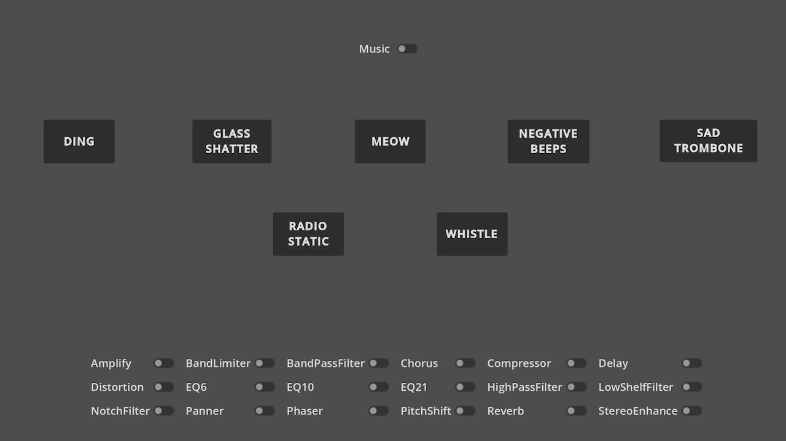

# Audio Effects demo

This is a simple demo that showcases the various Audio Effects that can be used in Godot.
One or more Audio Effects can be toggled and applied to the playable sound effects and background music.

See [Audio buses](https://docs.godotengine.org/en/stable/tutorials/audio/audio_buses.html)
and [Audio effects](https://docs.godotengine.org/en/stable/tutorials/audio/audio_effects.html)
in the manual for more information.

Language: GDScript

Renderer: Compatibility

## Screenshots

## Licenses

### Music

Monkeys Spinning Monkeys Kevin MacLeod (incompetech.com)
Licensed under Creative Commons: By Attribution 3.0 License
http://creativecommons.org/licenses/by/3.0/

### Sound Effects

All sound effects are from [Freesound](https://freesound.org/) and licensed under [CC0](https://creativecommons.org/publicdomain/zero/1.0/).

- [Ding](https://freesound.org/people/MatthewWong/sounds/361564/) by MatthewWong
- [Glass Breaking](https://freesound.org/people/chewiesmissus/sounds/244238/) by chewiesmissus
- [Meow](https://freesound.org/people/tuberatanka/sounds/110011/) by tuberatanka
- [Whistle](https://freesound.org/people/OwlStorm/sounds/320150/) by OwlStorm
- [Negative Beeps](https://freesound.org/people/themusicalnomad/sounds/253886/) by themusicalnomad
- [Sad Trombone](https://freesound.org/people/kirbydx/sounds/175409/) by kirbydx
- [Static](https://freesound.org/people/dotY21/sounds/335203/) by dotY21

### Icon
- [Equalizer](https://iconduck.com/icons/249702/equalizer) and licensed under [CC0](https://creativecommons.org/publicdomain/zero/1.0/).
