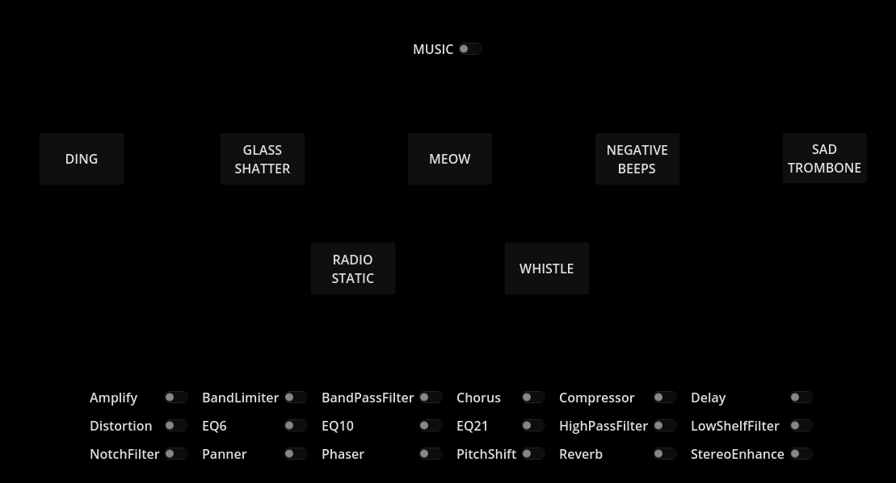

# Audio Effects demo

This is a simple demo that showcases the various Audio Effects that can be used in the Godot engine.
One or more Audio Effects can be toggled and applied to the playable sound effects and background music.

Language: GDScript

Renderer: Compatability

## Screenshots

## Licenses

### Music

Monkeys Spinning Monkeys Kevin MacLeod (incompetech.com)  
Licensed under Creative Commons: By Attribution 3.0 License  
http://creativecommons.org/licenses/by/3.0/

### Sound Effects

All sound effects are from [Pixabay](https://pixabay.com/) and are licensed under the Pixabay license.

Ding.mp3 is derived from [Correct-2 by bwg2020](https://pixabay.com/sound-effects/correct-2-46134/)

Glass Breaking.mp3 is derived from [Glass Breaking by Charlie Raven](https://pixabay.com/sound-effects/glass-breaking-93803/)

Meow.mp3 is derived from [cat purring and meow by skymary](https://pixabay.com/sound-effects/cat-purring-and-meow-5928/)

Whistle.mp3 is derived from [Wolf Whistle by Gogglecrab](https://pixabay.com/sound-effects/wolf-whistle-6777/)

Negative Beeps.mp3 is derived from [negative beeps by themusicalnomad](https://pixabay.com/sound-effects/negative-beeps-6008/)

Sad Trombone.mp3 is derived from [wah wah sad trombone by kirbydx](https://pixabay.com/sound-effects/wah-wah-sad-trombone-6347/)

Static.mp3 is derived from [Radio Static by dylanh.sound](https://pixabay.com/sound-effects/radio-static-6382/)
