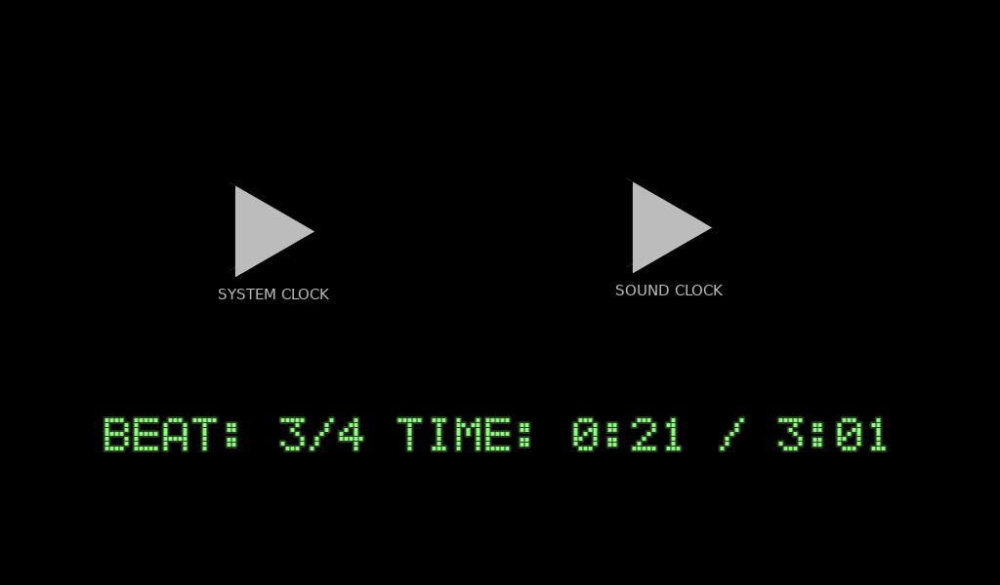

# Audio BPM Sync

A demo of how to sync the audio playback with the time for a consistent BPM.

Language: GDScript

Renderer: Compatibility

Check out this demo on the Asset Store: https://store.godotengine.org/asset/godot-foundation/audio-bpm-sync-demo/

## How does it work?

For the sound clock, it uses methods in
[`AudioServer`](https://docs.godotengine.org/en/latest/classes/class_audioserver.html)
to sync the audio playback.
For the system clock, it uses `OS.get_ticks_usec()`.

## Screenshots

