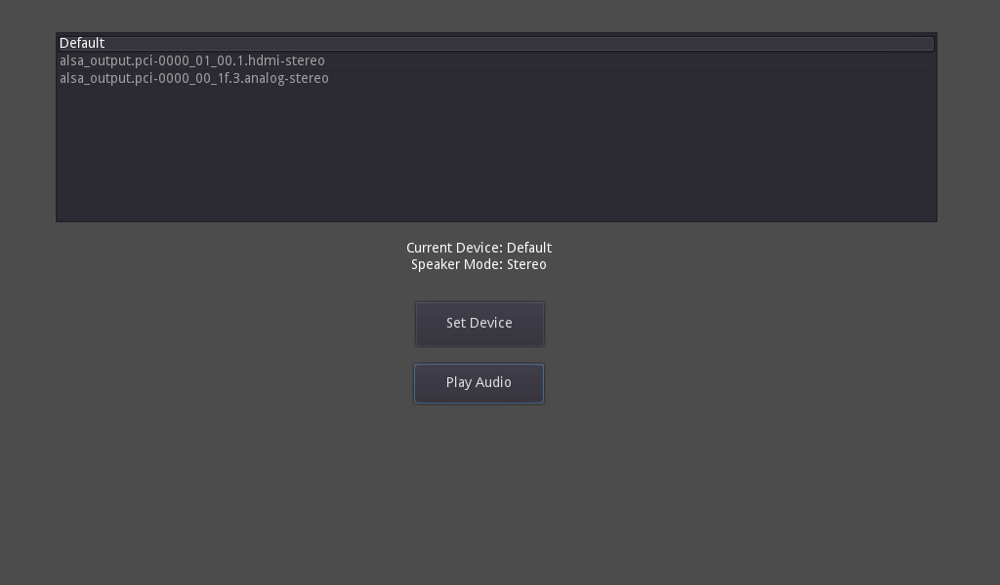

# Audio Device Changer

This is a demo showing how the audio output device can be changed from Godot.

Language: GDScript

Renderer: Compatibility

Check out this demo on the asset library: https://godotengine.org/asset-library/asset/2758

## How does it work?

It uses the `set_device()` method in
[`AudioServer`](https://docs.godotengine.org/en/latest/classes/class_audioserver.html)
to change the audio device.
The list of devices is populated using `get_device_list()`.

## Screenshots

