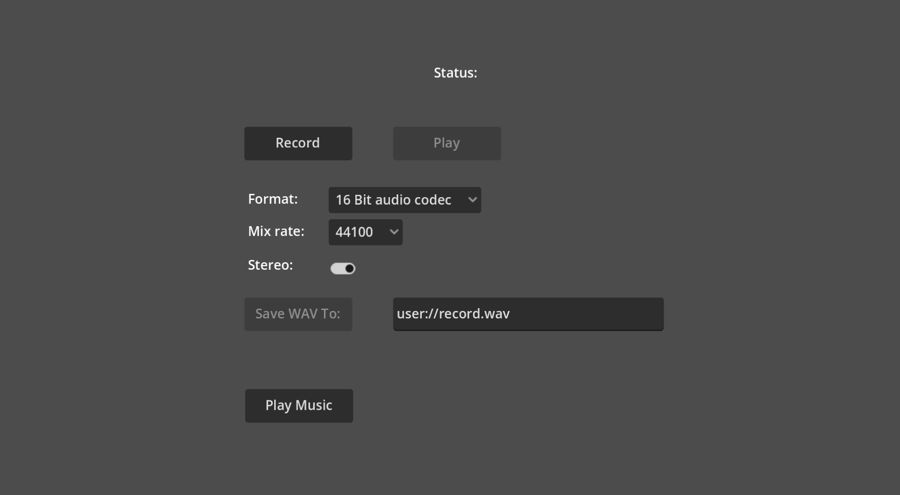

# Audio Mic Record

This is an example showing how one can record audio from
the microphone and later play it back or save it to a file.

With an addition on how to change the format, mix rate and
stereo settings of the recording.

Language: GDScript

Renderer: Compatibility

Check out this demo on the asset library: https://godotengine.org/asset-library/asset/2760

## Screenshots

