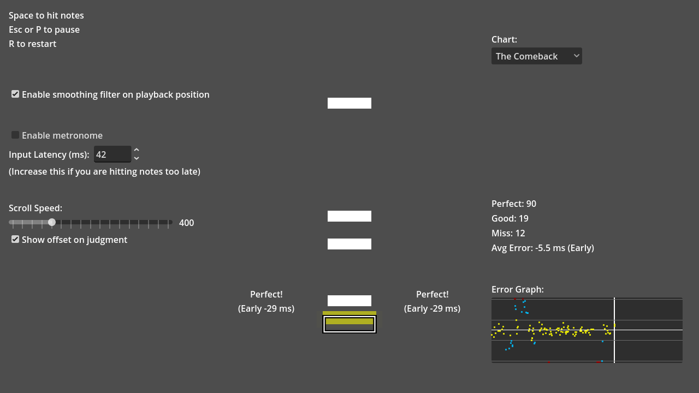

# Rhythm Game

A simple rhythm game that utilizes strategies described in the article
["Sync the gameplay with audio and music"](https://docs.godotengine.org/en/stable/tutorials/audio/sync_with_audio.html).

Playback position jitter is resolved using the
[1€ filter](https://gery.casiez.net/1euro/) to achieve smooth note movements.

The metronome sound was recorded by Ludwig Peter Müller in December 2020 under
the "Creative Commons CC0 1.0 Universal" license.

Language: GDScript

Renderer: Compatibility

Check out this demo on the asset library: TBD

## Screenshots

