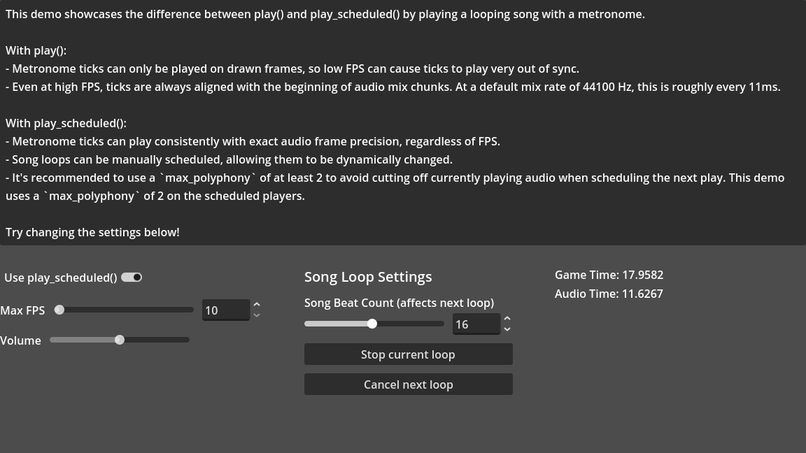

# Scheduled Metronome Demo

Godot project for showcasing `AudioStreamPlayer.play_scheduled()`. Plays a song
on loop with a metronome.

The metronome sound was recorded by Ludwig Peter Müller in December 2020 under
the "Creative Commons CC0 1.0 Universal" license.

Language: GDScript

Renderer: Compatibility

Check out this demo on the asset library: (TBD)

## Things to try

- Swap between `play` and `play_scheduled` for the metronome ticks.
- Adjust max FPS to showcase its effect on the metronome.

## Screenshots

