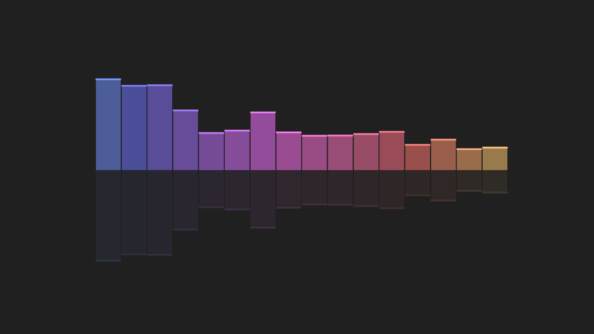

# Audio Spectrum

This is a demo showing how a spectrum analyzer can be built using Godot.

Language: GDScript

Renderer: Compatibility

Check out this demo on the asset library: https://godotengine.org/asset-library/asset/528

## Screenshots

