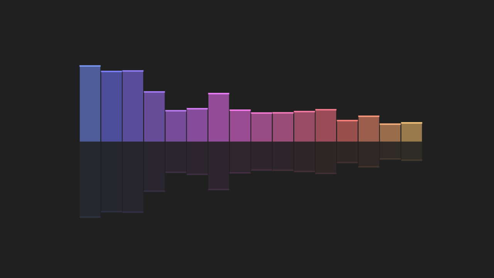

# Audio Spectrum

This is a demo showing how a spectrum analyzer can be built using Godot.

Language: GDScript

Renderer: Compatibility

Check out this demo on the Asset Store: https://store.godotengine.org/asset/godot-foundation/audio-spectrum-demo/

## Screenshots

