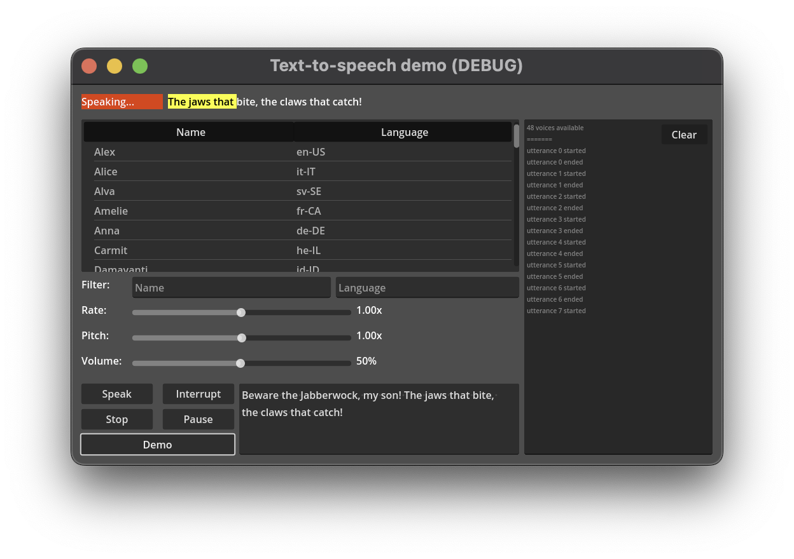

# Text-to-Speech Demo

This is a demo showing text-to-speech support.

Language: GDScript

Renderer: Compatibility

## How does it work?

It uses `tts_*()` methods of the [`DisplayServer`](https://docs.godotengine.org/en/latest/classes/class_displayserver.html) singleton
to enumerate voice information, send utterances to the OS TTS API, and receive callback signals.

## Screenshots

