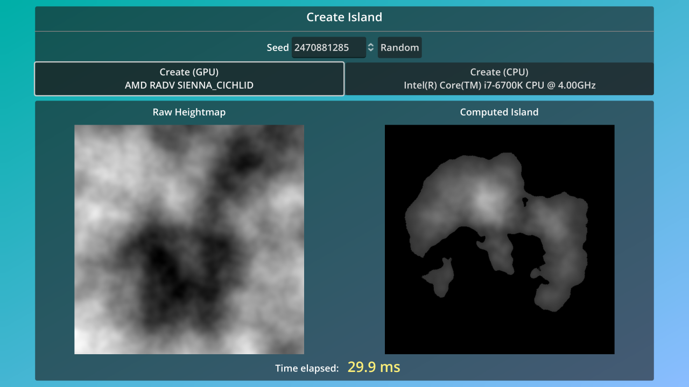

# Compute Shader Heightmap

This demo project gives an example of how to use *compute shaders* in Godot.
A compute shader is a piece of code that runs on the GPU and is written in GLSL
(as opposed to the
[Godot shader language](https://docs.godotengine.org/en/latest/tutorials/shaders/shader_reference/index.html)).

A compute shader can be used to take advantage of the GPU's ability to perform
massively parallel operations faster than a CPU. This demo can generate the
heightmap of an island from a noise texture, both on the CPU and the GPU. You
can try both options to compare the time it takes to generate the heightmap on
the CPU and GPU respectively.

For smaller noise textures, the CPU will often be faster, but the larger the
gains are by using the GPU. On a PC with a NVIDIA GeForce RTX 3060 and
11th-generation Intel Core i7 processor, the compute shader was tested to be
faster for textures 1024×1024 and larger.

The dimensions of the image can be set on the exported **Dimensions** property
on the main scene. By default, it's set to 2048, which creates a 2048×2048
heightmap.

> [!NOTE]
>
> The shader code has been structured to be followed step-by-step by the user,
> and may not necessarily represent best practices. The CPU code is also less
> optimized than it could be. This is to reflect the GPU code as much as
> possible. Besides the use of the GPU, no multithreading is used.

Languages: GDScript, GLSL

Renderer: Mobile

