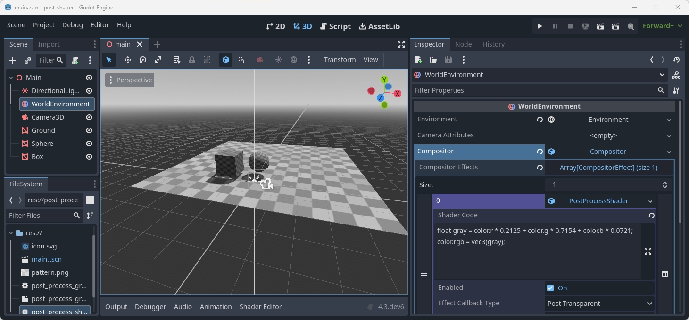

# Compositor Effects (Post-Processing)

This demo shows how to use compositor effects to create a post process.
This functionality only works in render device based renderers such as the Forward+ renderer.

Language: GDScript

Renderer: Forward+

> Note: this demo requires Godot 4.3 or later

## Screenshots

## Technical description

This demo shows the use of the new compositor effect system to add a compute shader based post process.
A compositor effect needs to first be implemented as a subclass of the `CompositorEffect` resource.
An instance of this resource can then be added to the `Compositor`
either as part of a `WorldEnvironment` node or as part of a `Camera3D` node.

During rendering of a viewport the `_render_callback` on this resource will be called
at the configured stage and additional rendering commands can be submitted.

The two examples in this project both add a compute call to apply a full screen effect.
Both are designed as tool scripts so they work both in editor and in runtime.

`post_process_shader.gd` shows an example where a template shader is used into which user code
is injected. The user code is stored in a property of the compositor effect.
This approach is able to recompile the shader as the property changes in runtime.
This approach is not able to make efficient use of shader caching and may not be supported on certain
platforms, such as certain consoles, that require precompiling of shaders.

`post_process_grayscale.gd` show an example where the shader code is stored in a file,
namely `post_process_grayscale.glsl` and is compiled on initialisation.
For editing a project this means that the shader is compiled once when the effect is loaded.
Making changes to the `glsl` file will require reloading the scene.
The advantage of this approach is that Godot can precompile the `glsl` file.
