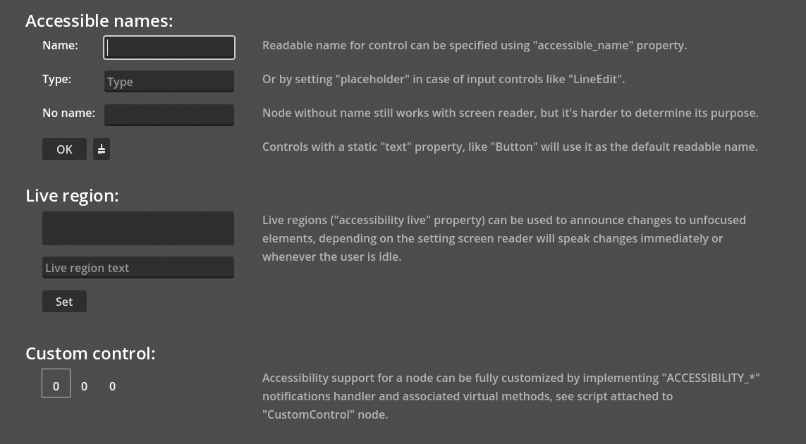

# UI Accessibility

This is a demo of UI accessibility in Godot.

Demo shows basic UI accessibility features and making custom nodes accessible.

Language: GDScript

Renderer: Compatibility

## Screenshots

