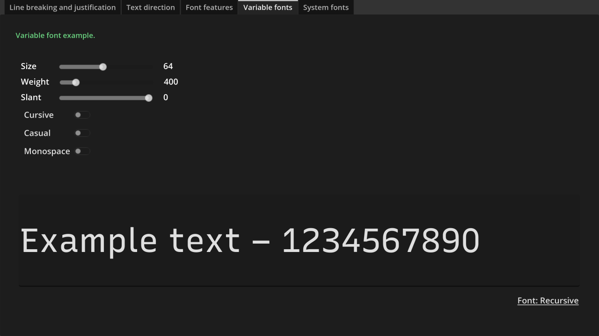
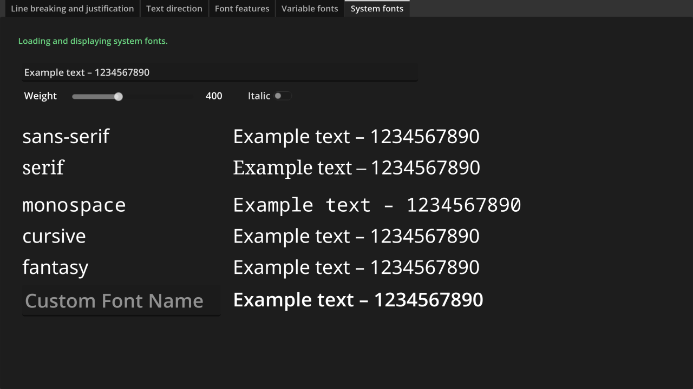

# BiDI and Font Features Demo

A demo showing BiDi text and BiDi overrides, line breaking and justification, and OpenType font features.

Language: GDScript

Renderer: Compatibility

Check out this demo on the asset library: https://godotengine.org/asset-library/asset/2765

## Screenshots

