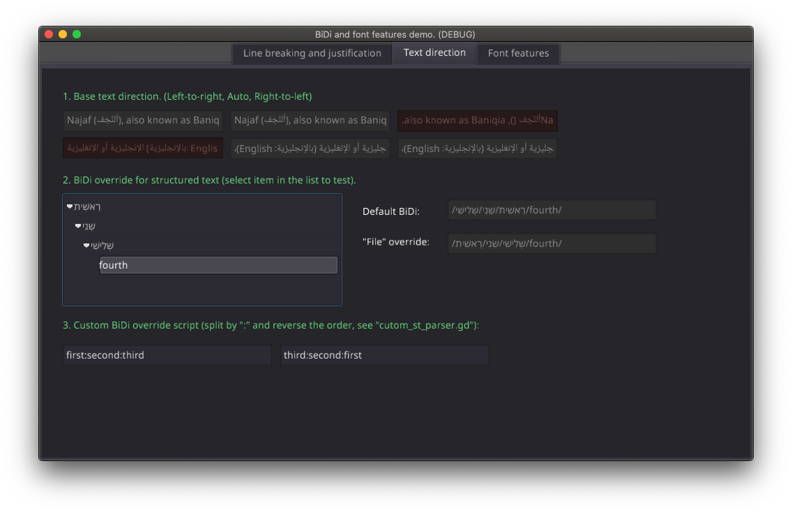
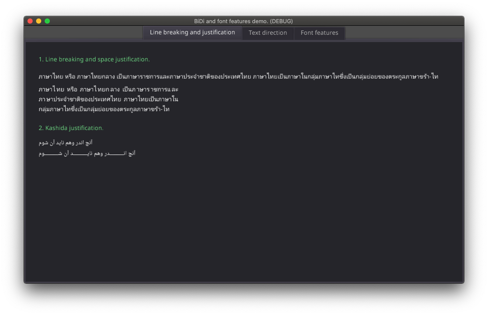
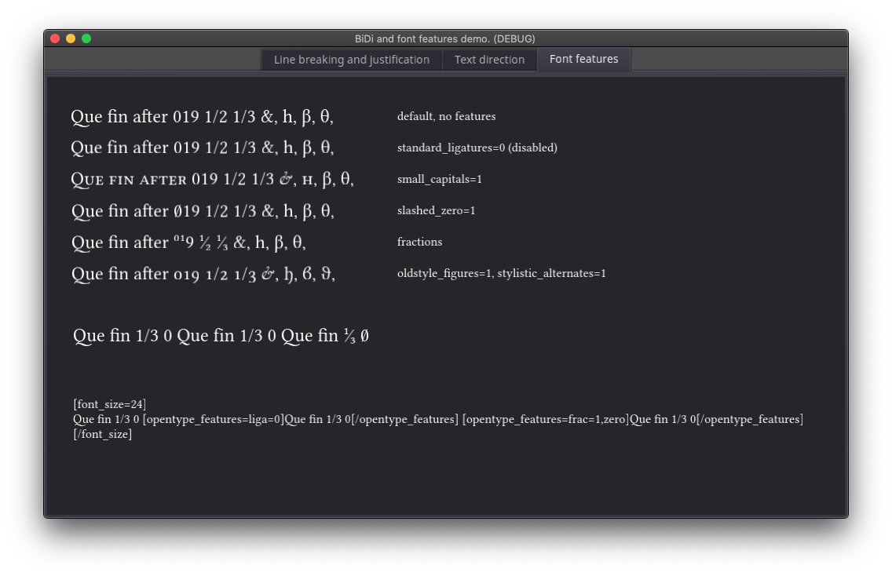
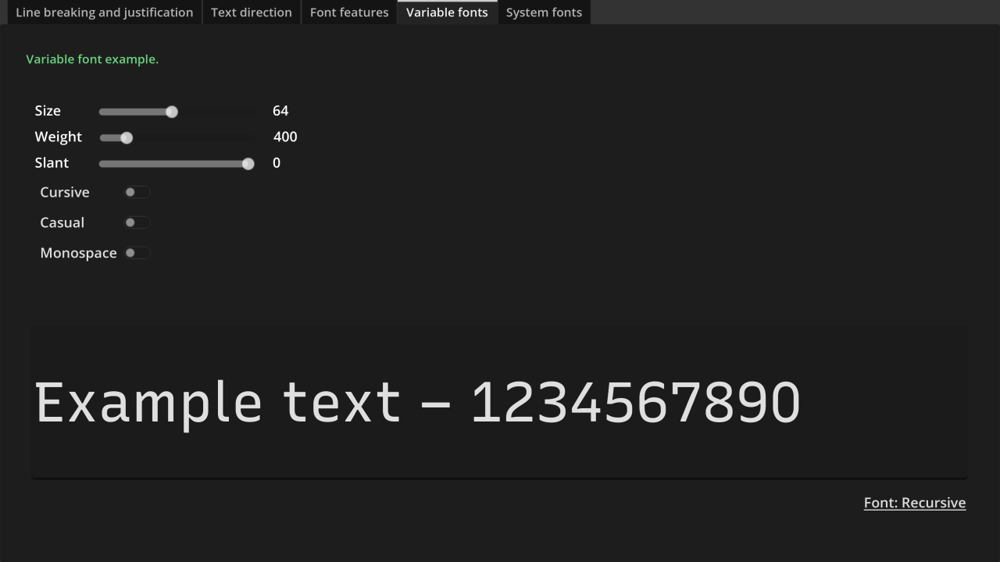
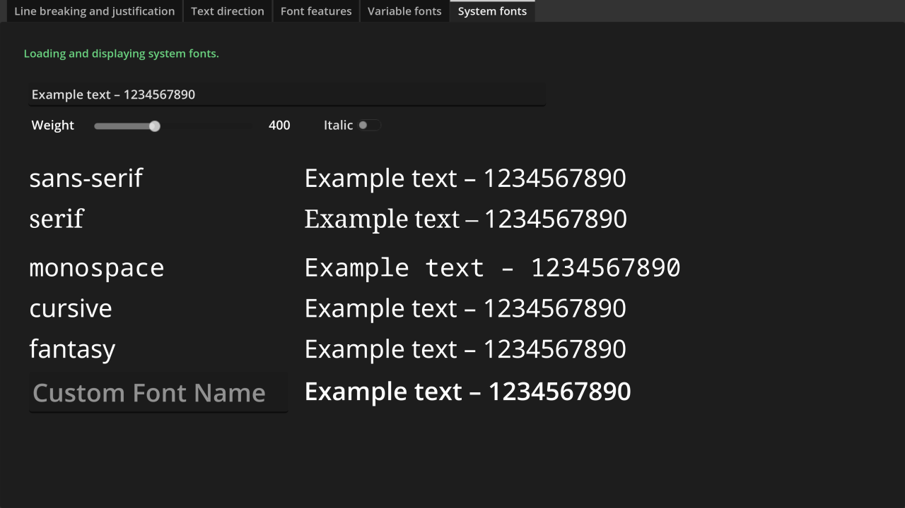

# BiDI and Font Features Demo

A demo showing BiDi text and BiDi overrides, line breaking and justification, and OpenType font features.

Language: GDScript

Renderer: Compatibility

Check out this demo on the Asset Store: https://store.godotengine.org/asset/godot-foundation/bidi-and-font-features-demo/

## Screenshots

