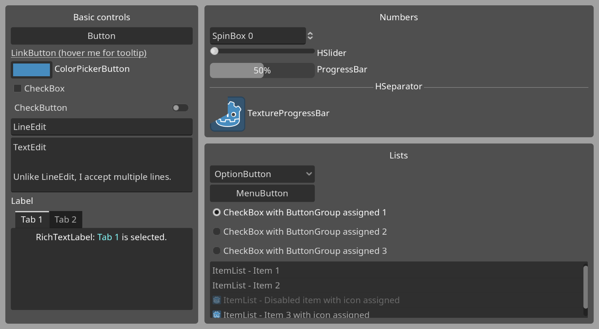

# Control Gallery

Showcases various Control nodes with their names affixed for easy recognition.
This demo is inspired by the "control gallery" demo found in GUI toolkits such as GTK.

- The 3 main panels ("Basic controls", "Numbers" and "Lists") are separated using a SplitContainer.
  This makes their individual size adjustable. Drag the empty space between panels to resize them.

Language: GDScript

Renderer: GLES 2

## Screenshots

