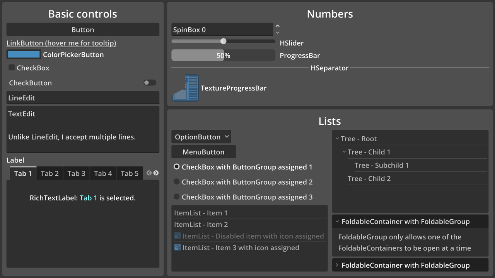

# Control Gallery

Showcases various Control nodes with their names affixed for easy recognition.
This demo is inspired by similar "control gallery" demos found in GUI toolkits
such as GTK.

The 3 main panels ("Basic controls", "Numbers" and "Lists")
are separated using HSplitContainer and VSplitContainer nodes.
This makes their individual size adjustable. Drag the empty
space between panels to resize them.

Language: GDScript

Renderer: Compatibility

Check out this demo on the asset library: https://godotengine.org/asset-library/asset/2766

## Screenshots

