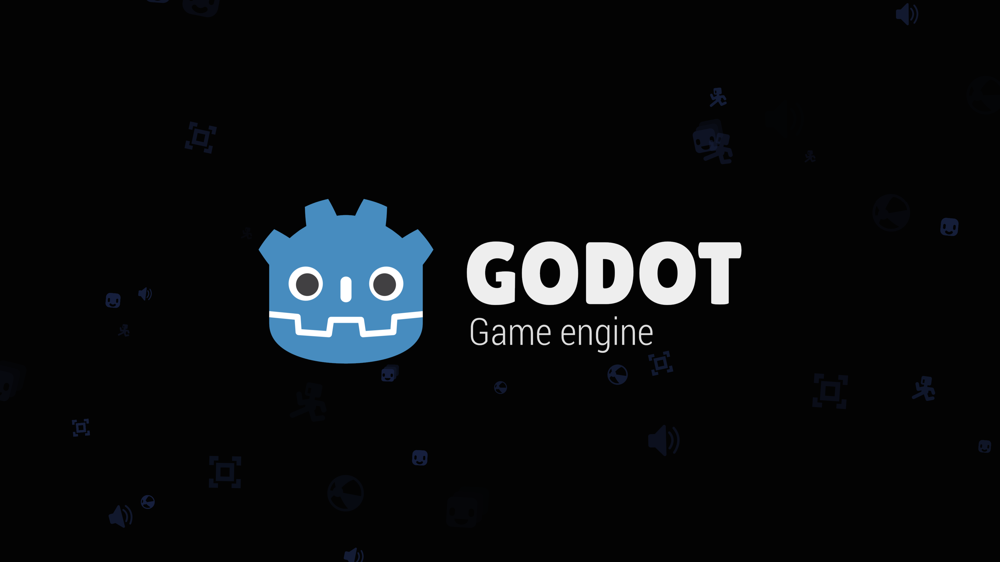

# Custom Splash Screen

A demo showing how to create a custom splash screen scene, while hiding the
default splash screen for a seamless experience.

This example showcases a simple animation with the AnimationPlayer node.
Since the engine is already running while it's displaying the splash screen,
anything can be done, including audio/video playback. See
[Playing videos](https://docs.godotengine.org/en/stable/tutorials/animation/playing_videos.html)
in the documentation for details.

Language: GDScript

Renderer: Compatibility

## How it works

- Project settings are configured in a way to hide the default splash screen.
  **Application > Boot Splash > Show Image** is disabled,
  and **Application > Boot Splash > BG Color** is set to the same color as
  the first frame of the splash scene (pure black).
- The main scene is configured to be `res://splash.tscn`.
- The main scene features an automatically playing AnimationPlayer.
  Its `animation_finished` signal is connected to a method that changes the scene
  to `res://main.tscn`.
  - The `res://main.tscn` scene is intentionally *not* preloaded to ensure the
    splash screen can display as quickly as possible. Otherwise, the main
    scene's assets would have to be fully loaded before the splash screen can
    begin its animation.

> [!TIP]
>
> To skip the splash screen during development, you can configure the main
> scene to be `res://main.tscn`, and override it using the `release`
> [feature tag](https://docs.godotengine.org/en/latest/tutorials/export/feature_tags.html)
> to `res://splash.tscn`.

## Screenshots

