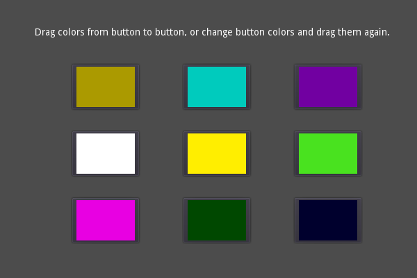

# Drag and Drop (GUI)

A demo showcasing drag and drop functionality.

- Drag and drop the color buttons to copy their colors over.
- Click on the buttons to manually adjust their color.

Language: GDScript

Renderer: GLES 2

Check out this demo on the asset library: https://godotengine.org/asset-library/asset/133

## Screenshots

