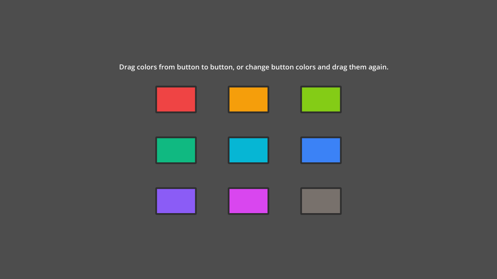

# Drag and Drop (GUI)

A demo showcasing drag and drop functionality.

- Drag and drop the color buttons to copy their colors over.
- Click on the buttons to manually adjust their color.

Language: GDScript

Renderer: Compatibility

Check out this demo on the Asset Store: https://store.godotengine.org/asset/godot-foundation/drag-and-drop-gui-demo/

## Screenshots

