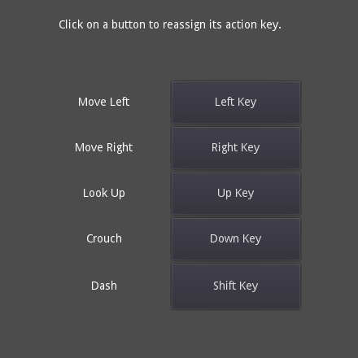

# GUI Input Mapping

A demo showing how to build an input key remapping screen.

- Click the buttons to change the bound keys.
- Persists the keys to disk, so they are preserved
  after the project is restarted.

Language: GDScript

Renderer: GLES 2

## Screenshots

