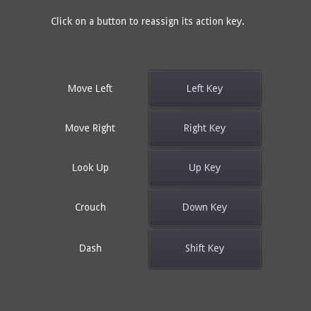

# GUI Input Mapping

A demo showing how to build an input key remapping screen.

- Click the buttons to change the bound keys.
- Persists the keys to disk, so they are preserved
  after the project is restarted.

Language: GDScript

Renderer: Compatibility

Check out this demo on the Asset Store: https://store.godotengine.org/asset/godot-foundation/gui-input-mapping-demo/

## Screenshots

